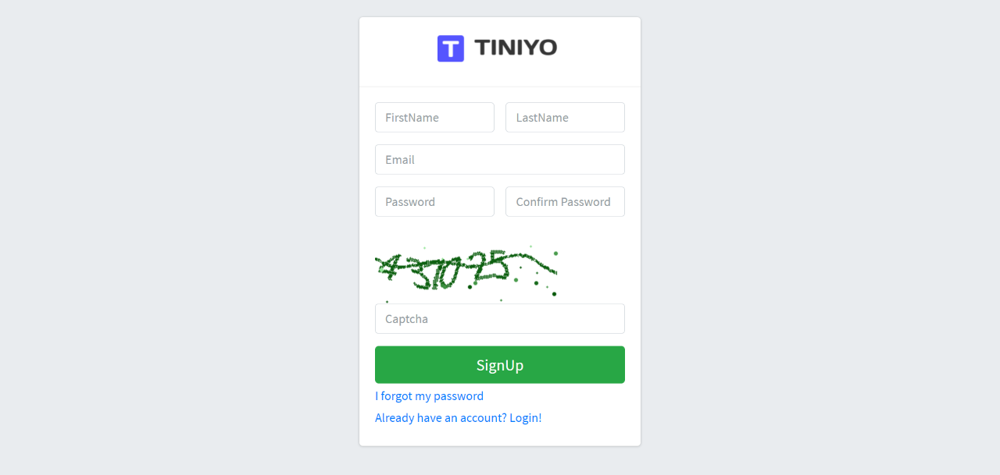
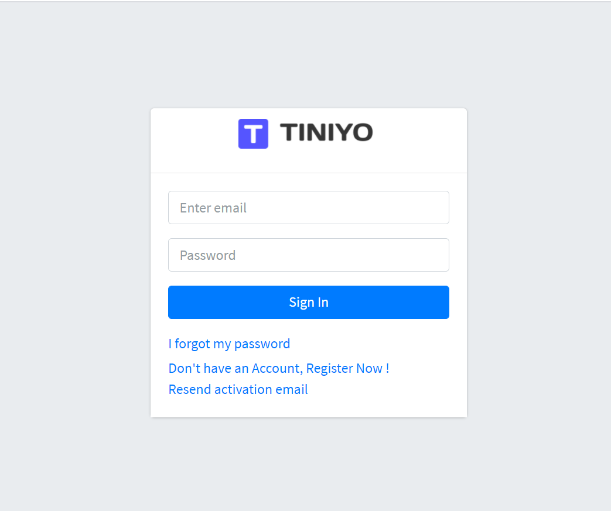
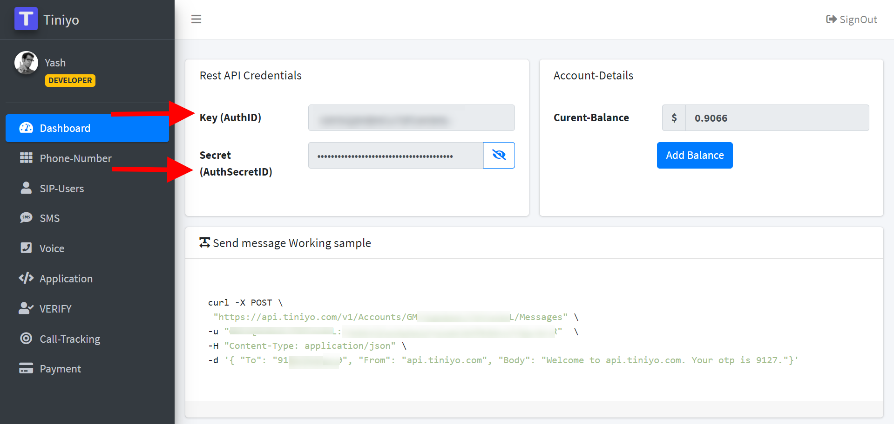
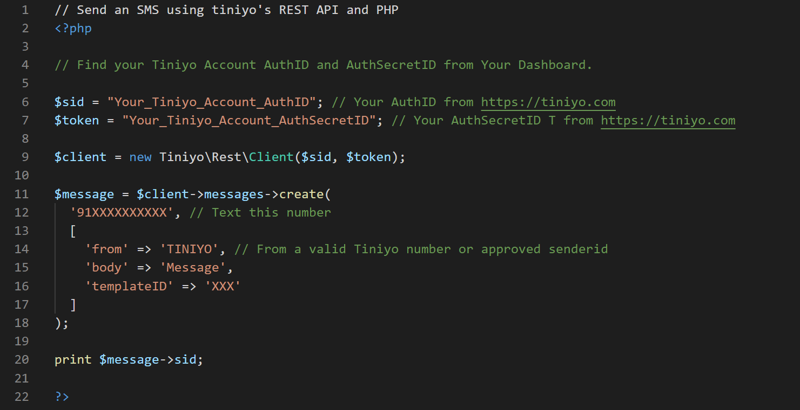
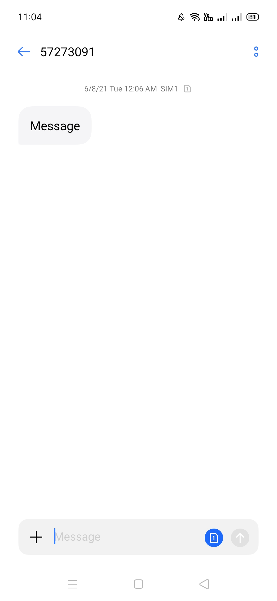

<h1 style="text-align: left;">Send SMS With PHP and Tiniyo</h1>

  
<a href="PHP_Tiniyo_cover.jpg" style="border: 1px solid black; clear: left; float: left; margin-bottom: 1em; margin-right: 1em;"></a>

  
  
 

  
Using Tiniyo's REST API, you can send outgoing SMS messages from&nbsp;

  
your Verified Tiniyo Phone number to mobile phones around the globe.

  

    
 

  

  
What you need&nbsp;

 

To follow this tutorial you will need :&nbsp;

 

1. A Tiniyo Account&nbsp;

 

2. Tiniyo PHP Package

 

3. PHP Code

 

 

Tiniyo generates an AuthID&nbsp;and an AuthSecretID when you create a Tiniyo account.

 

 

  <h3 style="background-color: white; box-sizing: inherit; clear: both; color: #333333; font-family: Raleway, Helvetica, Arial, sans-serif; font-size: 1.25rem; line-height: 1.1; margin: 0px auto 0.9375rem; max-width: 100%; overflow-wrap: break-word; padding-left: 0px; padding-right: 0px; word-break: break-word;">Step 1 – Create a Tiniyo Account.</h3>

 

If you already have a Tiniyo account, great!&nbsp; Feel free to skip to Step 2.&nbsp; If not, no worries !&nbsp;Go to&nbsp;<a href="https://www.tiniyo.com/" target="_blank">Tiniyo Official Website</a>. Click on Sign Up.

 

  

 

 

You will redirect to Sign Up page. FIll your details and click on "SignUp" Button.

 

 

 

<

 

 

Now, Your Account is Successfully Created. Verify your Phone Number using OTP.

 

After that Login into your Account using your Email Id and Password.

 

  

  <h3 style="background-color: white; box-sizing: inherit; clear: both; color: #333333; font-family: Raleway, Helvetica, Arial, sans-serif; font-size: 1.25rem; line-height: 1.1; margin: 0px auto 0.9375rem; max-width: 100%; overflow-wrap: break-word; padding-left: 0px; padding-right: 0px; word-break: break-word;"> </h3>
  <h3 style="background-color: white; box-sizing: inherit; clear: both; color: #333333; font-family: Raleway, Helvetica, Arial, sans-serif; font-size: 1.25rem; line-height: 1.1; margin: 0px auto 0.9375rem; max-width: 100%; overflow-wrap: break-word; padding-left: 0px; padding-right: 0px; word-break: break-word;">Step 2 – Get Your AuthID and AuthSecretID from Tiniyo Account.</h3>

 

Once you are logged into your account you will see Dashboard Like below Image.

 

Here, You will Find your AuthID and AuthSecretID for Request API.

 

  

  <h2 style="background-color: white; box-sizing: border-box; color: #444444; font-family: Whitney SSm A, Whitney SSm B, Helvetica Neue, Helvetica, Arial, sans-serif; font-size: 2rem; font-weight: 300; letter-spacing: -0.16px; line-height: 1.4; margin: 1.7rem 0px 15px; padding: 0px;"> </h2>
  <h2 style="background-color: white; box-sizing: border-box; color: #444444; font-family: Whitney SSm A, Whitney SSm B, Helvetica Neue, Helvetica, Arial, sans-serif; font-size: 2rem; font-weight: 300; letter-spacing: -0.16px; line-height: 1.4; margin: 1.7rem 0px 15px; padding: 0px;">Copy Your Key and Secet provided by Tiniyo and Store it.</h2>
  
Once you've got all that, let's dive into the code.

  <h2 style="background-color: white; box-sizing: border-box; color: #444444; font-family: Whitney SSm A, Whitney SSm B, Helvetica Neue, Helvetica, Arial, sans-serif; font-size: 2rem; font-weight: 300; letter-spacing: -0.16px; line-height: 1.4; margin: 1.7rem 0px 15px; padding: 0px;">Getting started with PHP</h2>

  
tiniyo-php provides sdk for tiniyo apis.

  <h3 style="background-color: white; box-sizing: border-box; color: #24292e; line-height: 1.25; margin-bottom: 16px; margin-top: 24px;">Supported PHP Versions</h3>
  
This library supports the following PHP implementations:

  <ul style="background-color: white; box-sizing: border-box; color: #24292e; margin-bottom: 16px; margin-top: 0px; padding-left: 2em;">
    <li style="box-sizing: border-box;">PHP 7.2</li>
    <li style="box-sizing: border-box; margin-top: 0.25em;">PHP 7.3</li>
    <li style="box-sizing: border-box; margin-top: 0.25em;">PHP 7.4</li>
    <li style="box-sizing: border-box; margin-top: 0.25em;">PHP 8.0.1</li>
  </ul>
  <h3 style="background-color: white; box-sizing: inherit; clear: both; color: #333333; font-family: Raleway, Helvetica, Arial, sans-serif; font-size: 1.25rem; line-height: 1.1; margin: 0px auto 0.9375rem; max-width: 100%; overflow-wrap: break-word; padding-left: 0px; padding-right: 0px; word-break: break-word;">Step 3 – Installation</h3>
  
 

  
You can install&nbsp;tiniyo-php&nbsp;via composer or by downloading the source.

  <h3 style="background-color: white; box-sizing: border-box; color: #24292e; line-height: 1.25; margin-bottom: 16px; margin-top: 24px;">
    <a aria-hidden="true" class="anchor" href="https://github.com/tiniyo/tiniyo-php#via-composer" id="user-content-via-composer" style="background-color: transparent; box-sizing: border-box; float: left; line-height: 1; margin-left: -20px; padding-right: 4px; text-decoration-line: none;">
      <svg aria-hidden="true" class="octicon octicon-link" height="16" version="1.1" viewbox="0 0 16 16" width="16"></svg>
      
        <path d="M7.775 3.275a.75.75 0 001.06 1.06l1.25-1.25a2 2 0 112.83 2.83l-2.5 2.5a2 2 0 01-2.83 0 .75.75 0 00-1.06 1.06 3.5 3.5 0 004.95 0l2.5-2.5a3.5 3.5 0 00-4.95-4.95l-1.25 1.25zm-4.69 9.64a2 2 0 010-2.83l2.5-2.5a2 2 0 012.83 0 .75.75 0 001.06-1.06 3.5 3.5 0 00-4.95 0l-2.5 2.5a3.5 3.5 0 004.95 4.95l1.25-1.25a.75.75 0 00-1.06-1.06l-1.25 1.25a2 2 0 01-2.83 0z" fill-rule="evenodd"></path>
      
    </a>
    Via Composer:
  </h3>
  
tiniyo-php&nbsp;is available on Packagist as the&nbsp;<a href="https://packagist.org/packages/tiniyo/tiniyo-php" rel="nofollow" style="background-color: transparent; box-sizing: border-box; text-decoration-line: none;"><code style="background-color: var(--color-markdown-code-bg); border-radius: 6px; box-sizing: border-box; margin: 0px; padding: 0.2em 0.4em;">tiniyo/tiniyo-php</code></a>&nbsp;package:

  

    <pre style="background-color: var(--color-bg-tertiary); border-radius: 6px; box-sizing: border-box; line-height: 1.45; margin-bottom: 16px; margin-top: 0px; overflow-wrap: normal; overflow: auto; padding: 16px;"><code style="background: transparent; border-radius: 6px; border: 0px; box-sizing: border-box; display: inline; line-height: inherit; margin: 0px; overflow-wrap: normal; overflow: visible; padding: 0px; word-break: normal;">composer require tiniyo/tiniyo-php</code></pre>
  

<h3>Send an SMS</h3>

It takes just a few lines of code and even fewer minutes to send your first text message with PHP and Tiniyo. Here’s how:

 

 

 

When creating a new message via the API, include the parameters :

<b>To , From , Body,&nbsp;TemplateId.</b>

<b>To :-&nbsp;</b>This parameter determines the destination phone number for your SMS message. Format this number with country code, e.g., 91XXXXXXXXXX.

 

 

<b>From :-</b>&nbsp;Specifies the Tiniyo Verified Phone number (or)&nbsp; TINIYO that sends this message. This must be a Tiniyo Verified phone number that you own, formatted with country code,&nbsp;e.g., 91XXXXXXXXXX.&nbsp;

 

 

<b>Body :-</b>&nbsp;The Body Parameter&nbsp;includes the full text of the message you want to send, limited to 1600 characters.

 

 

<b>TemplateID :-</b>&nbsp;TemplateID is mandatory field for the country india.

You can get this Id from Verify -&gt; Verify-Template using tiniyo account.

 

  
    
Save your file and run it.

    
php send-sms.php

  

Boom! Your phone should light up with a text!

<h1 style="text-align: left;">Output :</h1>

 

  
    

    
 

  
  That's it, you've sent an SMS message using PHP and Tiniyo API.

 

Thank You,

 

<b>Yash Joshi.</b>

